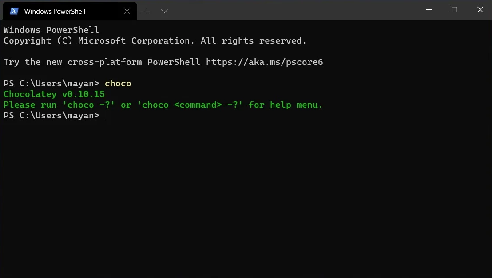

# [Chocolatey](https://github.com/chocolatey/choco)


## Ohjelma
- **Nimi:** Chocolatey
  
- **Kuvaus:** Chocolatey on Windows-käyttöjärjestelmälle tarkoitettu paketinhallintatyökalu. Sen avulla voidaan asentaa, päivittää ja poistaa ohjelmia komentoriviä hyödytäen.
  
- **Toimintaperiaate:**
Chocolatey toimii komentorivipohjaisena paketinhallintajärjestelmänä. Se käyttää valmiita paketteja, jotka sisältävät asennusskriptit ja ohjelmiston tarvittavat tiedot. Käyttäjä antaa komennon (esim. choco install ohjelma), jolloin Chocolatey hakee paketin joko julkisesta tai organisaation omasta pakettivarastosta, suorittaa asennuksen automatisoidusti ja hallinnoi myöhemmin päivityksiä ja poistamista. Maksullisissa versioissa hallinta voidaan toteuttaa myös keskitetysti useille koneille.
- Yleisimmät komennot: `choco install`, `choco upgrade`, `choco uninstall`, `choco list`
  - Lisää komentoja löytyy dokumentaatiosta: https://docs.chocolatey.org/en-us/choco/commands/

- **Käyttöesimerkki**[^1]<br>


- **Käyttökohteet:**
Chocolateyta voidaan käytetään esimerkiksi seuravanlaisissa kohteissa:
  - Kun halutaan automatisoida, helpottaa tai nopeuttaa ohjelmien asentamista, päivittämistä tai poistamista.
  - Jos halutaan asentaa uudelle koneelle valitut ohjelmat nopeasti
  - Yrityksissä, jotka tarvitsevat keskitettyä ohjelmistohallintaa ja versionhallintaa.


## Lisenssi
**Apache 2.0**
- Sallii ohjelmiston vapaan käytön, muokkauksen ja jakelun, mukaan lukien kaupallisen käytön.
- Ei vaadi, että muokatut versiot jaettaisiin samalla lisenssillä.
- Edellyttää alkuperäisen lisenssitekstin säilyttämisen.
- Ohjelmasta on olemassa avoimen lähdekoodin version lisäksi Pro- ja Business-versiot. Avoimen lähdekoodin versio ja Pro-versio ovat lisensoitu Apache 2.0 -lisenssillä, mutta Pro-versioon sovelletaan lisäksi erillistä lisäkäyttöoikeussopimusta (Additional EULA). Business-versio ei sen sijaan ole Apache 2.0 -lisensoitu, vaan siihen sovelletaan omaa ohjelmistolisenssisopimusta (Master Software License Agreement). Kyseessä on kaupallinen sopimus, joka sisältää rajoitetun käyttöoikeuden, 30 päivän takuun sekä vastuunrajoituksia.

## Projektin Aktiivisuus ja Ylläpito
### Historia
Rob Reynolds loi Chocolateyn vuonna 2011 yksinkertaisena tavoitteenaan tarjota universaali paketinhallintaohjelma Windowsille.
-2011 Chocolately luodaan
-2013 Ensimmäinen commit nykyisessä repositoryssä
-2016 Chocolately Software perustetaan
-2016 Chocolately for Busines (C4B) -tuote
  
### Aktiivisuus 
- Projektiin tehdään päivityksiä ja korjauksia lähes viikoittain. Joinakin viikkoina päivityksiä ei tule lainkaan, kun taas toisinaan committeja voi olla kymmeniä yhden viikon aikana.
- Repository on haarautettu 932 kertaa, mikä kertoo siitä, ettei kyseessä ole aivan pieni projekti.
- Chocolately on saanut 11,3 tuhatta tähteä GitHubissa, mikä osoittaa että projekti on suosittu ja siitä pidetään.
- Projektilla on 5054 committia.
- Kehittäjiä yhteensä 118 eri henkilöä.
- Viimeisin versio 2.6.0
- Latauksia 371 Miljoonaa.
  
### Ylläpito
Projektia ylläpitää alkuperäinen kehittäjä Rob Reynolds tiimeineen. Hän on perustanut projektin ympärille kaupallisen yhtiön ja palkannut henkilöstöä tiimiinsä. Projektiin voi osallistua kuka tahansa esimerkiksi raportoimalla bugeja tai korjaamalla virheitä.

## Osallistuminen Projektiin
### Contribution Model
Projektiin voi osallistua kuka tahansa. Osallistumistapoja ovat muun muassa:
- Ongelmien/bugien ilmoittaminen
- Parannnusehdotukset
- Koodimuutokset (bugien korjaus, ominaisuuksien kehittäminen)
- Dokumentaation parantaminen

**Roolit**
- Kehittäjät:
  - Tekevät muutoksia koodiin
  - Lähettävät pull requesteja

- Ylläpitäjät eli Chocolatey:n tiimi:
  - Käsittelevät kehittäjien tekemiä pull requesteja
  - Yhdistävät tehtyjä muutoksia olemassa oleviin haaroihin
  - Hyväksyvät tai hylkäävät ehdotuksia (Issue)

### Osallistumisen Menettelytavat
1. Kaikki koodimuutokset vaativat oman GitHub Issuen. Tehtäviä voi ottaa työn alle kahdella eri tavalla:
   - Ennakkohyväksyntä: Jos haluaa ehdottaa parannusta tai korjata bugin, jota ei ole vielä listattu, tulee ennen aloittamista saada Chocolatey:n tiimiltä hyväksyntä.
   - Valmiit tehtävät: Tehtäviä, jotka on jo valmiiksi hyväksytty ja merkitty "Up For Grabs" -merkinnällä, voi tehdä ilman erillistä lupaa.

**HUOM.** Jos muutos ei ole triviaali[^2] täytyy ennen muutoksen tekemistä allekirjoittaa Contributor License Agreement (CLA)[^3].

2. Valmistele kehitysympäristö:
   - Suositellaan käyttämään Visual Studio 2019 tai uudempaa versiota
   - Forkkaa repository
   - Kloonaa se paikallisesti
   - Luo uusi haara muutokselle

3. Toteuta muutos
   - Noudata projektin koodityyliohjeita[^4]
   - Lisää tai päivitä testit muutoksille
  
4. Commit
   - Tee pieniä, loogisia committeja
   - Commitin tulee sisältää muutokseen liittyvät testit
   - Aloita commit-viesti issuen tunnisteella ja lisää lyhyt kuvaus muutoksesta (n. 50 merkkiä), esim. "(#1234) Lyhyt kuvaus"
      - Jos muutos liittyy dokumentaatioon, laitetaan commitin alkuun (doc)
      - Jos muutos liittyy triviaaleihin muutoksiin, laitetaan commitin alkuun (maint)
   - Tarvittaessa voidaan jättää tyhjä rivi otsikkorivin jälkeen, jolloin voi kirjoittaa tarkentavan kuvauksen tehdystä muutoksesta
  
5. Lähetä pull request
   - Tee pull request `develop`-haaraan.
   - Kerro tehdyt muutokset ja mainitse issuen tunniste
   - Vastaa ylläpitäjien palautteeseen ja tee mahdolliset korjaukset tai muutokset

Tarkemmat osallistumisohjeet löytyvät Chocolateyn GitHub-repositoriosta:
[CONTRIBUTION.md](https://github.com/chocolatey/choco/blob/develop/CONTRIBUTING.md)


## Tekninen Toteutus
- **Kielet:**
  - C# (70.7 %)
  - PowerShell (29.1 %)
- **Protokollat:**
  - HTTP/HTTPS - pakettien lataamiseen
  - NuGet-protokolla - pakettien jakeluun
- **Välineet:**
  - Git & GitHub - versionhallinta
  - Visual Studio - kehitysympäristö
  - .NET - suoritusalusta ja ohjelmistokehys


## Projekti Käyntiin
### Normaali asennus
- **Vaatimukset:**
  - .NET Framework 4.8 tai uudempi versio
  - PowerShell 2.0 tai uudempi versio
  - Windows Server 2008 R2 / Windows 10 tai uudempi versio
 
1. Avaa PowerShell järjestelmänvalvojan oikeuksilla
2. Suorita:
```powershell
Set-ExecutionPolicy Bypass -Scope Process -Force; [System.Net.ServicePointManager]::SecurityProtocol = [System.Net.ServicePointManager]::SecurityProtocol -bor 3072; iex ((New-Object System.Net.WebClient).DownloadString('https://community.chocolatey.org/install.ps1'))
```
3. Suorita `choco` varmiistaaksesi asennuksen onnistuminen
   - Asennus onnistui, jos tulostuu `Chocolatey [versio]`
   

### Asennus lähdekoodista
- **Vaatimukset:**
  - .NET Framework 4.8
  - .NET Framework 4.8 Dev Pack
  - Visual Studio 2019 or Visual Studio 2019 Build Tools
  - .NET SDK
 
1. Lataa lähdekoodi tietokoneelle:
   ```bash
   git clone https://github.com/chocolatey/choco.git
   ```
2. Siirry lähdekoodin juureen:
   ```bash
   cd choco
   ```
3. Käännä suorittamalla:
   ```bash
   ./build.ps1
   ```
4. Käännetty ohjelma löytyy polusta:
   `code_drop\temp\_PublishedApps\choco_merged\choco.exe`

Tarkemmat ohjeet projektin kääntämiseen eri käyttöjärjestelmillä (Windows, Linux ja Mac) löytyvät projektin [README.md](https://github.com/chocolatey/choco?tab=readme-ov-file#compiling--building-source)-tiedostosta. Linux- ja Mac-ympäristöissä kääntäminen vaatii Mono-ympäristön ja .NET SDK:n asennuksen. 

[^1]: Lähde: https://raw.githubusercontent.com/wiki/chocolatey/choco/images/gifs/choco_install.gif
[^2]: Triviaaleja muutoksia ovat esimerkiksi kirjoitusvirheen korjaaminen ja dokumentaatiomuutokset. 
[^3]: https://cla-assistant.io/chocolatey/choco
[^4]: https://github.com/chocolatey/choco/blob/develop/CONTRIBUTING.md#code-format--design
